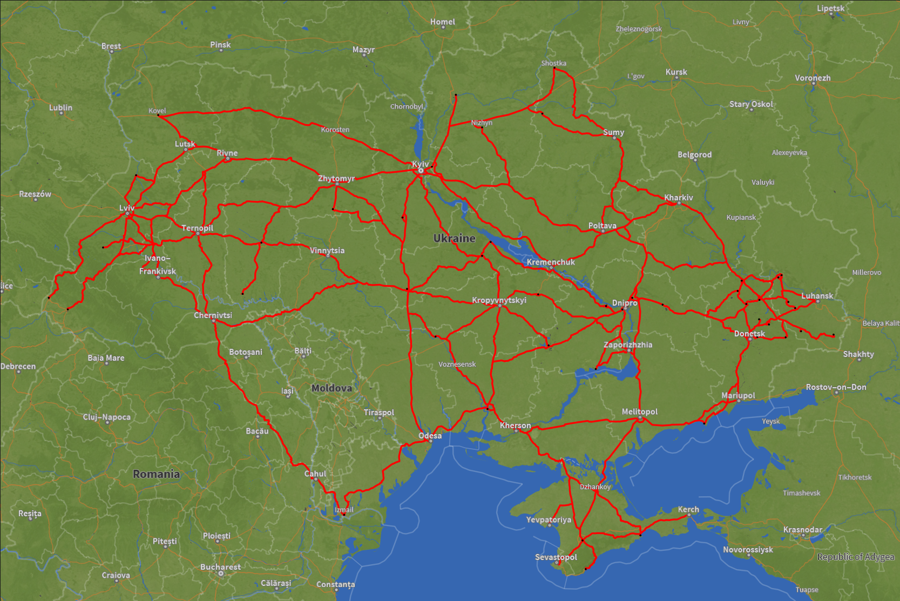
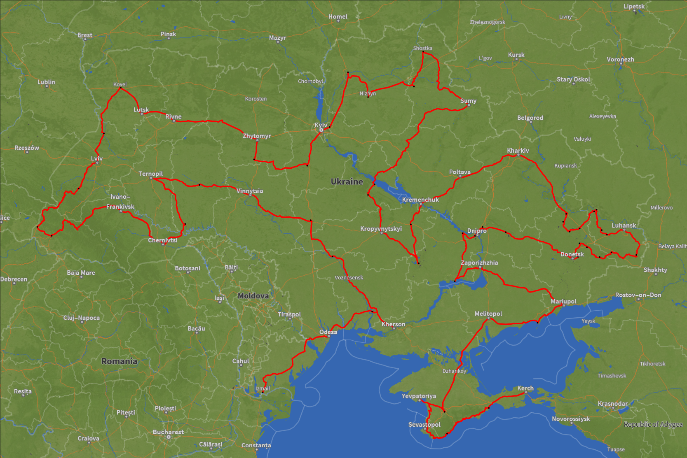
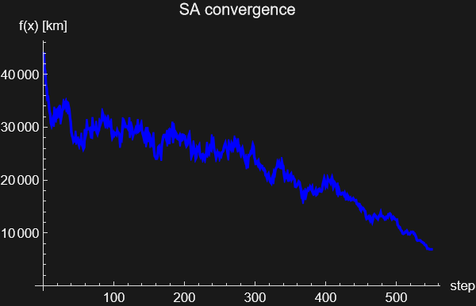
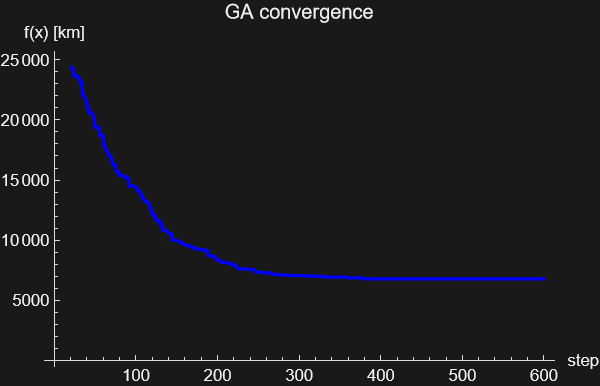

# Travelling Salesman Problem: Simulated Annealing vs Genetic Algorithm

> Solving the Travelling Salesman Problem (TSP) for the **70 largest Ukrainian cities** using two stochastic metaheuristics — **Simulated Annealing (SA)** and a **Genetic Algorithm (GA)** — implemented in *Wolfram Mathematica*.

---

## Table of Contents

1. [Problem Statement](#problem-statement)
2. [Why Stochastic Algorithms?](#why-stochastic-algorithms)
3. [Algorithms](#algorithms)
   - [Simulated Annealing](#simulated-annealing)
   - [Genetic Algorithm](#genetic-algorithm)
4. [Implementation](#implementation)
5. [Input Parameters](#input-parameters)
6. [Results](#results)
7. [Repository Structure](#repository-structure)
8. [How to Run](#how-to-run)
9. [Acknowledgements](#acknowledgements)
10. [Literature](#literature)

---

## Problem Statement

The **Travelling Salesman Problem (TSP)** is one of the most studied combinatorial optimisation problems. Given a set of $n$ cities, the goal is to find the shortest open path visiting each city exactly once:

$$\min_{x \in \mathcal{P}_n} f(x) = \sum_{i=1}^{n-1} d(x_i,\, x_{i+1})$$

where $\mathcal{P}_n$ is the set of all permutations of $n$ cities and $d(\cdot,\cdot)$ is the road driving distance between two cities.

This implementation solves the TSP for the **70 largest Ukrainian cities** (selected via Mathematica's `CityData[{All, "Ukraine"}]`), using real road driving distances (`TravelDistance`, `"Driving"` mode). The initial random tour and the final optimised routes are shown below.

| Random initial tour | SA final tour | GA final tour |
|:-------------------:|:-------------:|:-------------:|
|  |  |  |

---

## Why Stochastic Algorithms?

TSP belongs to the class of **NP-hard** problems. For $n$ cities the number of distinct open tours is $(n-1)!/2$, which grows super-exponentially — for $n = 70$ this exceeds $10^{98}$. Brute-force enumeration and exact methods (Held–Karp runs in $O(n^2 2^n)$) are completely intractable at this scale.

**Metaheuristic** approaches are therefore the practical choice:

- **Escape local optima** — SA achieves this through temperature-controlled acceptance of worse solutions; GA through crossover and mutation that maintain genetic diversity across an entire population.
- **Solution-space agnostic** — the same framework works regardless of the specific distance metric, city layout, or problem variant.
- **High-quality approximate solutions** in polynomial-time budget — both methods consistently reduce tour length by ~6× over a random initial permutation.
- **Straightforward to implement and tune** with a small set of interpretable parameters.

Both SA and GA have long, well-documented track records on TSP instances of all scales.

---

## Algorithms

### Simulated Annealing

Simulated Annealing is inspired by the annealing process in metallurgy, where a material is slowly cooled to minimise its internal energy. Temperature $T$ controls the willingness to accept a *worse* solution, allowing escape from local optima.

**Algorithm:**

```
Input:  x⁰     — initial tour (random permutation),
        T₀     — initial temperature (auto-calibrated via findT0),
        α      — cooling factor,
        k_max  — Metropolis steps per temperature level,
        T_min  — stopping temperature

x = x⁰;  T = T₀
while T > T_min:
    for k = 1 … k_max:
        x_new = neighbourC(x)         // 2-opt segment reversal
        Δf    = f(x_new) − f(x)
        if P(Δf, T) ≥ Uniform[0,1]:
            x = x_new                 // Metropolis acceptance
    T = α · T                         // exponential cooling
return x
```

**Metropolis acceptance criterion:**

$$P(\Delta f, T) = \min\left\\{1,\ e^{-\Delta f / T}\right\\}$$

A deteriorating move ($\Delta f > 0$) is accepted with probability $e^{-\Delta f/T}$. At high $T$ almost all moves are accepted (exploration); as $T \to 0$ only improvements are accepted (exploitation).

**Automatic $T_0$ calibration** (`findT0[x0, neighbourC, 1000]`): performs a 1 000-step random walk collecting all positive $\Delta f$ values, then solves $e^{-\langle \Delta f^+\rangle / T_0} = 0.5$, guaranteeing approximately 50 % of worsening moves are accepted at the start.

**Perturbation operators** (neighbours of a tour $x$):

| Label | Operator | Description |
|-------|----------|-------------|
| A | Adjacent swap | Swap two neighbouring cities in the permutation |
| B | Random swap | Swap any two cities in the permutation |
| **C** | **Segment reversal (2-opt)** | **Reverse the sub-path between two randomly chosen positions — used in both SA and GA** |

---

### Genetic Algorithm

The Genetic Algorithm mimics biological evolution: a **population** of candidate tours undergoes **selection**, **crossover** (recombination), and **mutation** across successive **generations**.

**Algorithm:**

```
Input:  popSize  — population size,
        nElite   — elite size,
        ngen     — number of generations,
        Pm       — mutation probability,
        tournSz  — tournament size

pop    = popSize random tours
fvals  = f(x) for each x in pop

for gen = 2 … ngen:
    newPop = nElite best individuals from pop      // elitism
    while |newPop| < popSize:
        p1    = tournamentSelect(pop, fvals, tournSz)
        p2    = tournamentSelect(pop, fvals, tournSz)
        child = orderCrossover(p1, p2)
        if Uniform[0,1] ≤ Pm:
            child = neighbourC(child)              // 2-opt mutation
        newPop.append(child)
    pop    = newPop
    fvals  = f(x) for each x in pop
return best individual
```

**Order Crossover (OX):**

1. Pick a random contiguous segment from Parent 1 and copy it into the child at the same positions.
2. Fill the remaining positions with cities from Parent 2 in their original order, skipping already-placed cities.

**Example:**
```
Parent 1:  [1, 2, | 3, 4, 5, | 6]
Parent 2:  [3, 1,   5, 6, 2,   4]
                 ↓ OX
Child:     [1, 6, | 3, 4, 5, | 2]
```

**Tournament selection:** draw `tournSz` random individuals; the one with the shortest tour becomes a parent.

---

## Implementation

The algorithms are implemented in **Wolfram Mathematica 14.3** (`.nb` notebook).

Key implementation details:

- **City data:** `n = 70` largest Ukrainian cities loaded via `CityData[{All, "Ukraine"}]`; road distances fetched with `method = "Driving"`, `quantity = "TravelDistance"`.
- **Distance matrix** `L[i,j]` is precomputed once at startup as an $n \times n$ matrix and reused throughout — avoids repeated expensive `TravelDistance` queries inside the inner loops.
- **Tour length** is evaluated in $O(n)$ by summing the precomputed entries along the route.
- **Automatic $T_0$** (`findT0[x0, neighbourC, 1000]`): 1 000-step random walk → solve $e^{-\langle \Delta f^+\rangle / T_0} = 0.5$ → yields $T_0 \approx 579.82$ km.
- **SA** stores every accepted state in list `X`; the convergence plot subsamples `X` to ≤ 500 display points via `X[[1 ;; -1 ;; Max[1, Floor[Length[X]/500]]]]`.
- **GA** stores `historyGA` as a list of `{bestTour, generation, bestLength}` triples; convergence is plotted from the third column.
- **Elitism** in GA: `nElite` best individuals are copied unchanged before crossover/mutation fill the rest.
- **Mutation** in GA reuses the same 2-opt operator (`neighbourC`) as SA.

---

## Input Parameters

### Simulated Annealing

| Parameter | Symbol | Value | Description |
|-----------|--------|-------|-------------|
| Number of cities | $n$ | `70` | Top-70 Ukrainian cities by population |
| Initial temperature | $T_0$ | `≈ 579.82 km` (auto) | Calibrated so ~50 % of worsening moves are accepted |
| Cooling factor | $\alpha$ | `0.99` | Geometric cooling: $T_{i+1} = \alpha \cdot T_i$ |
| Metropolis steps / level | $k_{\max}$ | `50` | Inner-loop iterations before lowering $T$ |
| Minimum temperature | $T_{\min}$ | `0.00001 km` | Stopping criterion |
| Perturbation operator | — | `neighbourC` (2-opt) | Segment reversal between two random positions |

### Genetic Algorithm

| Parameter | Symbol | Value | Description |
|-----------|--------|-------|-------------|
| Number of cities | $n$ | `70` | Same city set as SA |
| Population size | $N$ | `200` | Number of tours per generation |
| Elite size | $N_{\text{elit}}$ | `60` | Tours copied unchanged to the next generation |
| Generations | $n_{\text{gen}}$ | `600` | Total number of generations |
| Mutation probability | $P_m$ | `0.5` | Probability of applying 2-opt mutation to a child |
| Tournament size | $k_t$ | `3` | Candidates drawn per tournament selection |
| Crossover operator | — | `orderCrossover` (OX) | Order Crossover preserving sub-path from Parent 1 |
| Mutation operator | — | `neighbourC` (2-opt) | Segment reversal |

---

## Results

All experiments use **road driving distances** between the 70 largest Ukrainian cities.

### Convergence

| SA convergence | GA convergence |
|:--------------:|:--------------:|
|  |  |

### Summary table

| Metric | SA | GA |
|--------|----|----|
| Cities | 70 | 70 |
| Initial tour length | **43 976 km** (random permutation) | **36 896 km** (best of initial population) |
| Final tour length | **6 910 km** | **6 787 km** |
| Reduction factor | ≈ 6.4× | ≈ 5.4× vs. own initial best |
| Steps / generations | 3 848 accepted steps | 600 generations |
| Convergence character | Noisy gradual descent | Rapid early drop, smooth plateau |

**Observations:**
- GA converges to a slightly shorter tour (6 787 km vs 6 910 km for SA).
- SA convergence is noisier due to stochastic acceptance of worse solutions; noise decreases as temperature falls.
- GA benefits from population-level information sharing — crossover recombines good partial sub-tours from multiple individuals simultaneously, enabling a faster drop in early generations.
- Both algorithms improve the random initial permutation by approximately 6×.
- The SA convergence plot is subsampled to ≤ 550 display points from 3 848 total stored states.

### Optimised routes

| SA final route | GA final route |
|:--------------:|:--------------:|
|  |  |

GA produces a visually cleaner route with fewer crossing edges, consistent with its lower final tour length.

### Video demonstrations

| Video | Link | Description |
|-------|------|-------------|
| **SA — Ukraine TSP** | [▶ YouTube](https://youtu.be/kA8am6jNm4M) | Simulated Annealing solving TSP on 70 Ukrainian cities — animated accepted-step evolution across 3 848 steps converging from **43 976 km** to **6 910 km** |
| **GA — Ukraine TSP** | [▶ YouTube](https://youtu.be/tn9F32EiJSs) | Genetic Algorithm solving TSP on 70 Ukrainian cities — best-individual tour across **600 generations** converging from **36 896 km** to **6 787 km** |

---

## Repository Structure

```
tsp-sa-vs-ga-ukraine/
│
├── README.md
│
├── notebooks/
│   └── SA_GA_Cities_TravelDist.nb       # Wolfram Mathematica notebook
│
└── img/
    ├── randPermutation.png               # Initial random tour
    ├── lastSA.png                        # SA optimised final tour
    ├── lastGA.png                        # GA optimised final tour
    ├── sa_convergence_550steps_rescale.png  # SA tour-length vs step
    └── ga_convergence.png                # GA best-tour-length vs generation
```

---

## How to Run

1. **Requirements:** Wolfram Mathematica 12+ with an active internet connection (required for `TravelDistance` and `CityData` knowledge-base queries).

2. **Open the notebook:**
   ```
   File → Open → notebooks/SA_GA_Cities_TravelDist.nb
   ```

3. **Evaluate all cells in order** (`Evaluation → Evaluate Notebook`).
   - The **Initialize** section loads city data and builds the $70 \times 70$ distance matrix. This may take **1–2 minutes** on first run due to `TravelDistance` calls.
   - The **SA** and **GA** sections are independent and each run in a few minutes.

4. **Explore interactively** — `Manipulate` widgets let you step through SA accepted states or GA generations frame by frame.

5. **Tune parameters** — modify the parameter block at the top of each algorithm section (`alpha`, `kmax`, `Tmin` for SA; `popSize`, `nElite`, `ngen`, `Pm`, `tournSz` for GA) and re-evaluate.

> **Note:** `TravelDistance` queries are rate-limited by Wolfram's servers. If the distance matrix computation stalls or returns incomplete results, wait a few minutes and retry.

---

## Acknowledgements

This project was developed as part of the course **I1-OPT2: Optimalizácia 2** at the **Faculty of Civil Engineering, Slovak University of Technology in Bratislava** (Stavebná fakulta STU Bratislava), study programme **B-MPM**.

Special thanks to:

- **[prof. RNDr. Martin Knor, PhD.](https://is.stuba.sk/auth/lide/clovek.pl?id=860)** — examiner, lecturer, and person responsible for the course; co-author of the course textbook *Optimalizácia 2* which provides the theoretical foundation, pseudocode, and mathematical framework for both algorithms implemented here.

- **[Ing. Mgr. Lukáš Tomek, PhD.](https://is.stuba.sk/auth/lide/clovek.pl?id=59517)** — examiner, instructor, and co-author of the course textbook; the base Mathematica notebook — including city data loading, distance matrix construction, geo-visualisation, and all three perturbation operators — was created by him and served as the starting point for this implementation.

## Literature

1. **Knor M., Tomek L.** — *Optimalizácia 2*, STU Bratislava, 2019.
   [[PDF]](https://www.svf.stuba.sk/buxus/docs/dokumenty/skripta/Knor_M.__Tomek_L._Optimalizacia_2_web.pdf)
   *(Primary course reference; Sections 10.3 and 11 cover SA and GA with pseudocode and TSP application.)*

2. **Kirkpatrick S., Gelatt C. D., Vecchi M. P.** — *Optimization by Simulated Annealing*, Science, 220(4598):671–680, 1983.
   [[DOI]](https://doi.org/10.1126/science.220.4598.671)
   *(Seminal paper introducing SA; includes TSP experiments.)*

3. **Černý V.** — *Thermodynamical Approach to the Traveling Salesman Problem: An Efficient Simulation Algorithm*, Journal of Optimization Theory and Applications, 45(1):41–51, 1985.
   [[DOI]](https://doi.org/10.1007/BF00940812)
   *(Independent discovery of SA with explicit TSP formulation.)*

4. **Holland J. H.** — *Adaptation in Natural and Artificial Systems*, University of Michigan Press, 1975; MIT Press (2nd ed.), 1992.
   *(Foundational work on genetic algorithms.)*

5. **Goldberg D. E.** — *Genetic Algorithms in Search, Optimization, and Machine Learning*, Addison-Wesley, 1989.
   *(Standard GA textbook; covers crossover operators, selection strategies, and TSP encoding.)*

6. **Davis L.** — *Applying Adaptive Algorithms to Epistatic Domains*, Proceedings of IJCAI, 1985.
   *(Introduced Order Crossover (OX) for permutation-based problems such as TSP.)*

7. **Johnson D. S., McGeoch L. A.** — *The Traveling Salesman Problem: A Case Study in Local Optimization*, in *Local Search in Combinatorial Optimization*, Wiley, 1997.
   *(Comprehensive empirical comparison of local-search and metaheuristic methods on TSP.)*

8. **Boyd S., Vandenberghe L.** — *Convex Optimization*, Cambridge University Press, 2004.
   [[Online]](https://web.stanford.edu/~boyd/cvxbook/)
   *(Background reference for Lagrangian duality and barrier methods discussed in the course.)*

---
